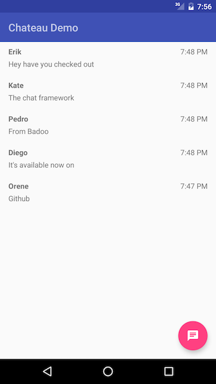
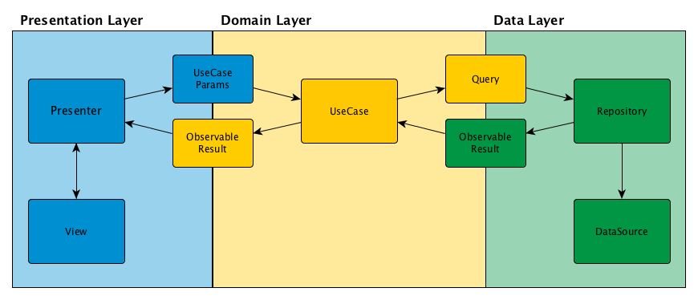

#Chateau

Chateau is a framework for adding (or improving) chat functionality in any Android app. Built in a modular way using MVP and Clean Architecture, it can easily be integrated with your chat backend with only minor changes to the included UI.

<div align="center">
    
    
</div>

## Background

Chat has always been a major component of the apps we develop at Badoo. Over the years we have gone through multiple rewrites and refactorings of our core chat code but up until now we have always kept it under wraps. With project Chateau we aimed to create a great chat experience, and not just for us but for everyone.

Our goals when we set out were as follows:

 * Easy to understand code, by consistently applying design patterns accross the framework and example app
 * Easy to integrate with any chat backend
 * Well documented with good test coverage
 * As few as possible external dependencies, because no one likes a bloated library
 * Open source, because that's how we roll at Badoo

If you're reading this as an iOS developer, some of our engineers already implemented a similar framework for iOS.  The result of their efforts can be found [here](https://github.com/badoo/Chatto).

## Architectural overview

### Clean Architecture

The architecture of the app is based upon the concept of [Clean Architecture](https://blog.8thlight.com/uncle-bob/2012/08/13/the-clean-architecture.html) put forward by Robert Martin, which we adapted to fit our needs. In a Clean Architecture, the code is divided into layers where each layer must only have dependencies to lower layers (or as shown in the diagram below, dependencies going towards the right). This in combination with the Model-View-Presenter (MVP) pattern has allowed us to divide the code into components which can be individually tested by mocking dependencies to lower layers.

Chateau is divided into 3 layers:

<div align="center">
    
</div>

##### Presentation Layer

This layer contains all UI related logic (Views and Presenters), it knows nothing of the data layer and is only able to perform actions by invoking usecases that resides in the Domain layer. As with the other layers, the presentation layer is interchangable without affecting the other two layers. All results from use cases are observed (using RxJava) on the main thread to ensure threading consistency and make it easy to update the UI.

##### Domain Layer

Contains the application's use cases which encapsulate application specific business rules, for example SignIn or SendChatMessage would be an example of use case.  Use cases are able to query the data layer (Repositories), but should know nothing of the implementation of that layer. All subscriptions to the data layer are made on the computation thread.

##### Data Layer

Finally the data layer contains interaction with the network, databases or other locations where data can be retrieved or stored. Changing the underlying implementation should not affect the other two layers. The data layer can also consist of several different sources chained together (i.e memory cache, disk cache and finally network request for loading conversations).

##### Further reading

As the above only gives a rough overview of clean architecture I'd strongly recommend checking out the following:

  - [Clean Architecture presentation (57:24)](https://vimeo.com/43612849) by Robert C. Martin, long but well worth watching.
  - [Android, Clean Architecture](https://github.com/android10/Android-CleanArchitecture) an example of clean architecture on Android also using Rx by [Fernando Cejas](https://github.com/android10)
  - Fernando has also written a couple of complementary blog posts to the example above which can be found [here](http://fernandocejas.com/2014/09/03/architecting-android-the-clean-way/).

### Using Repositories and Datasources

The data layers consists of repositories and data sources.  Generally repositories are used to map queries to data sources.  The aid with this, the [DelegatingRepository.java](https://github.com/badoo/Chateau/tree/master/Barf/src/main/java/com/badoo/barf/data/repo/DelegatingRepository.java) has been created, which allows query handlers to be registered for each query which in turn map them to a data source.  It is also possible to annotate a data source using the [Handles.java](https://github.com/badoo/Chateau/tree/master/Barf/src/main/java/com/badoo/barf/data/repo/annotations/Handles.java) annoatation.  Currently this is progressed using reflection, but there is a future task to before this via an annoation processor.

It is important to note, that the [Query](https://github.com/badoo/Chateau/tree/master/Barf/src/main/java/com/badoo/barf/data/repo/Query.java) has a generic type.  This at first may seem redundent, but it used to type the result type when used against a repository.  Initially repositories could only return a single type, which didn't really make sense in most situations, and also let to the point where most repositoties returned a list of a type, when most of the time only the single of that type was needed.

Generally we model our datasource in the following way:
  - A subscription method, which returns the current data that data source contains. (Note in some rare cases multiple subscription methods will be needed, however this generally indicates that the data source should be split)
  - Command methods which cause modification to the data in the data source.  Once the modification is complete, the current state of the data should be published to any subscribers.
  - Query methods which query data contains in the data source.  These may or may not return some data, but will not cause data to be published to subscribers.

Examples of the configuration of Repositories and Datasources can be found in [ChatExampleApp.java](https://github.com/badoo/Chateau/tree/master/ExampleApp/src/main/java/com/badoo/chateau/example/ChatExampleApp.java).


### How we MVP

There are many different approaches that can be taken to implement MVP *(Model-View-Presenter)* on Android. The one we selected is something that we have been iterating on internally at Badoo over the last 6 months. 

```java
interface Presenter {
	
	void onUserDidSomething();
	
	void onUserDidSomethingElse(int what);
	
	interface View {
		void showA(A a);
		void showB(B b);
	}
}
```

Presenters and Views are defined together as interfaces, giving us a clear overview of all the interactions that can occur between the two. By always using interfaces it is also very easy to replace the actual (Presenter or View) implementation with a mock when testing.

Another decision we made was to always keep the View implementation separate from the Activity or Fragment which is using it. This allows the view to be easily used in either one.

#### View and Presenter implementations

When creating an implementions of views and presenters we follow a certain set of practices.

  - The following is passed to the presenter constructor:
    - The View implementation (by its interface)
    - The use cases the presenter requires to operate
  - The view implementation is given via it's constuctor
    - A [PresenterFactor](https://github.com/badoo/Chateau/tree/master/Barf/src/main/java/com/badoo/barf/mvp/PresenterFactory.java) which is used to instantiate the presenter.  This allows both the view and presenter to have access to each other in their constuctors.  Because of this pattern, calls to the view's methods during the constuction of the presenter should be avoided.
    - A [ViewFinder](https://github.com/badoo/Chateau/tree/master/ChateauExtras/src/main/java/com/badoo/chateau/extras/ViewFinder.java) is generally used to find the views as it allways easy access to finding views by id whether the view owner is a Fragment or an Activity.

**Note:** When adding functionality to a screen, it is prefered to additional presenters (composition) rather than extending the current presenter, however there is times where the later is preferable.

### Wiring it all together

We decided to keep it simple and simply wire the app together by hand, you can see how in the [ChatExampleApp.java](https://github.com/badoo/Chateau/tree/master/ExampleApp/src/main/java/com/badoo/chateau/example/ChatExampleApp.java).  However of course a DI framework such as [Dagger2](https://google.github.io/dagger/) could be used.

## Project overview

Chateau is split into several modules, each one (except the example app) published separately to jCenter. For instructions on how to include them in your build see the *Integrating Chateau in your app* section.

### BARF

The **B**adoo **AR**chitectural **F**ramework provides the foundation of Chateau. It contains definitions of Model, View and Presenters as well as Use cases and Repositories.

### ChateauCore

Contains interface definitions for the chat related model classes (such as Message, Conversation, etc), use cases dealing with these models and the Repository and DataSource definitions needed to provide basic chat functionality. This module only contains core functionality which can be expected to be useful in any chat implementation.

If you are looking to build a more customized chat experience (without the extra functionality provided by the main Chateau library) then consider building it on top of ChateauCore instead.

### Chateau

The main library containing implementations for the different Presenters which together provides the chat experience (Listing, creating and deleting conversations, listing and sending messages, retrieving information about users). In addition to this it contains implementations for the models defined in ChateauCore.

### ChateauExtras

Contains any useful utility classes that are not part of the core framework, at some point this might be moved to a seperate library outside of the Chateau project.

### ExampleApp

A simple example app which shows how to to integrate Chateau with your UI and backend. Contains the concrete View and DataSource implementations as well as the UI (Activities and layouts).

## Third party dependencies

 * [RxJava](https://github.com/ReactiveX/RxJava)
 * [RxAndroid](https://github.com/ReactiveX/RxAndroid)
 * [Retrolambda](https://github.com/orfjackal/retrolambda)
 * [JacocoEverywhere](https://github.com/paveldudka/JacocoEverywhere)
 * The example app has additional dependencies including Parse and [Fresco](https://github.com/facebook/fresco).

Our initial goal was to have no external dependencies except for the Android SDK. The reason being that we did not want to force any additional dependencies on someone looking at integrating the chat framework into their application. However, after weighing the alternatives of using RxJava compared to rolling our own framework we eventually decided upon using RxJava.

The main reasons for this descision were:

 * Communication between the architectural layers (Data source &rarr; Repository &rarr; Use case &rarr; Presenter)
 * Provide thread boundraries to ensure that the correct thread is always used (for heavy operations, IO and UI updates)

## Example Application

The Chateau example app provides a showcase for how to integrate the Chateau framework. It contains a reference chat UI implementation (supporting text and image messages, group chats and more) coupled with an back-end integration layer that communicates with a very simple chat server using HTTPS and sockets (server source also comes bundled with the app).

In order to run the example app you will need to have a backend to connect to. For this there are two options: either connect to our testing backend or set up your own.

### Connecting to our testing server

There is no special configuration needed to do this (the example app is already configured for this endpoint) but please be aware that we do not make any guarantees regarding the data on the testing server. Any user created there as well as any conversation or message may be deleted at any point, at our discretion.

### Setting up the example app chat server

**Please note:** *The chat example backend currently runs on Parse. Unfortunately, just after we got the backend up and running it was announced that Parse is closing down in the beginning of 2017. We are currently evaluating our options for either migrating to a different service or creating a stand alone example server.*

The quickest way to get up and running with the example chat backend is to import it into your Parse account (only possible if you have an existing account as Parse is no longer accepting new registrations). If you don't already have a Parse account the other option is to set up a stand alone instance of [parse-server](https://github.com/ParsePlatform/parse-server).

A zip archive containing the json definition of the required Parse classes can be found in the ExampleApp/files directory. There you can also find the CloudeCode source code.

* [Getting started with CloudeCode](https://parse.com/docs/cloudcode/guide#command-line-installation) follow this guide to import the provided JS source code.
* [Importing the Parse class definitions](https://www.youtube.com/watch?v=3H_SM35wnpA)

The last step you need to take it to set up the socket notification proxy. This lightweight server acts as a bridge between HTTP (request coming from the backend) and socket notifications (sent out to connected clients). This open source project can be [found here](https://github.com/erikandre/notification-proxy). Please note that you need to run it on a computer that is accessible (using port 9000) to the devices running the chat example app.

Now that you got the server up and running it's time to point the app towards the two endpoints. In ChatExampleApp/build.gradle you will find the following three build configuration keys (found in `ExampleApp/build.gradle`):

 * `PARSE_APP_ID`
 * `PARSE_CLIENT_KEY`
 * `SOCKET_NOTIFICATION_ENDPOINT`

## Integrating Chateau in your app

In order to get your basic chat functionality up and running there are two main components that needs to be added.

 * Backend integration (in the form of data sources)
 * UI (for displaying different types of messages as well as for handling composing the messages)

### Backend integration

To integrate Chateau with your backend you will need to create implementations of the following DataSources:

* `com.badoo.chateau.core.repos.messages.MessageDataSource`
* `com.badoo.chateau.core.repos.conversations.ConversationDataSource`
* `com.badoo.chateau.core.repos.istyping.IsTypingDataSource`
* `com.badoo.chateau.core.repos.users.UserDataSource`

The next step is to make sure that instances of the repositories for these data sources are available to the Use Cases that needs them. Exactly how you want to do this is up to you but here are some suggestions:

* Singletons (easy but could make testing a bit messy)
* Use a dependency injection framework (e.g. Dagger 2)
* Instantiate when needed (could work if they have no state)

In the example app we are using a simple configuration class that contains references to all the needed repositories. Please check `com.badoo.chateau.example.ui.ExampleConfiguration` and `com.badoo.chateau.example.ChatExampleApp` for an example of this.

**TIP:** *If you want to add functionality to the built-in presenters we would in most cases recommend that you add a separate presenter or a composite presenter. However, the base class can also be extended using inheritance as long as you take care when dealing with the generic parmeters for the View type.*

### UI Integration

The main part of the UI integration work is to implement the Views (MVP Views that is) that are matched up with the Presenters defined in the Chateau library.

For basic functionality (to be able to list the current conversations and read and send messages in a conversation) you will need to implement the following views.

* `com.badoo.chateau.ui.chat.input.ChatInputPresenter.ChatInputView`
* `com.badoo.chateau.ui.chat.messages.MessageListPresenter.MessageListView`
* `com.badoo.chateau.ui.conversations.list.ConversationListPresenter.ConversationListView`

Optionally you can also implement the following views if you want to be able to pick an user to start a conversation with.

* `com.badoo.chateau.ui.conversations.create.selectusers.UserListPresenter.UserListView`
* `com.badoo.chateau.ui.conversations.create.namegroup.NameGroupPresenter.NameGroupView`

After doing this you will need to make sure that both the presenters and views are created in your Activity or Fragment.
The following simple example shows how this could be done in the activity's `onCreate()` method.

```
final PresenterFactory<RegistrationView, RegistrationPresenter> presenterFactory = new PresenterFactory<>(v -> createRegistrationPresenter(v, target));
new RegistrationViewImpl(..., presenterFactory);
presenter = presenterFactory.get();
```

In the example above the `createRegistrationPresenter(...)` method creates the presenter and passes in the use cases that are needed. These use cases in turn needs access to the repositories that you previously configured (see Backend Integration for more details).

## Who are we?
Many people at Badoo have contributed greatly to the Chateau project in one form or other (Thanks go out to everyone contributing to the architecture as well as our awesome QA team!).

### Erik

I'm a senior Android developer at Badoo with 7 years of experience creating awesome apps for mobile devices. Check out my [Github profile](https://github.com/erikandre) for other projects that I'm involved in.

### Rich

I'm also a senior Android developer at Badoo where I've been since moving to London.  I have been passionate about Android since its release and my first Android phone (HTC Hero!).  Outside of programming I enjoy music (post-rock, metal) especially gigs and festivals, I'm an avid cycler and love to travel.  You can find my Github profile [here](https://github.com/kingamajick).

## Roadmap

 - [ ] Migrate example app backend from Parse
 - [ ] Use annotation processing instead of reflection when creating delegating respositories

## License

Source code is distributed under MIT license.

##Blog
Read more on our [tech blog](http://techblog.badoo.com/) or explore our other [open source projects](https://github.com/badoo)
